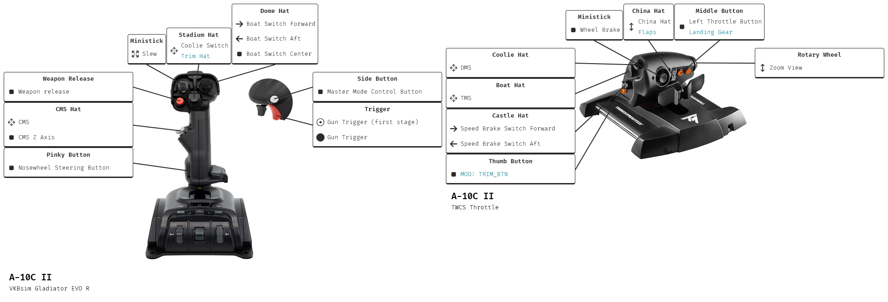

# Mapping image (template) generator for DCS

Requires controller image and [controller].json with button xy-image coordinates and desired section on resulting template. Tool will automaticly generate templates for all installed aircraft + controllers and localize if required.

## Example mapping image (template):

## Current state:

Refactoring templater.py to separate modules
